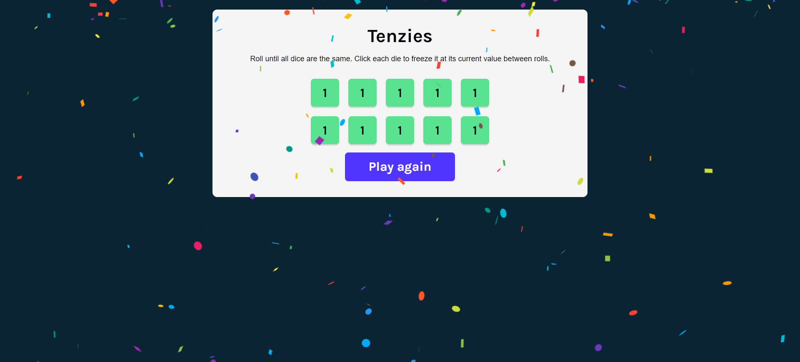

# Tenzies game - Learn React Project from Scrimba

This is a project for the 'Learn React' course from Scrimba.

## Screenshot

## Links

- Live Site URL: https://main--cl4ram-tenzies-react-game.netlify.app/

## My process

- useState and useEffect
- Conditional rendering

## To-do

- ~~Put real dots on the dice~~
- ~~Track the number of rolls~~
- ~~Track the time to win~~
- ~~Save best time and best rolls to localStorage~~
- Start the game on start button
